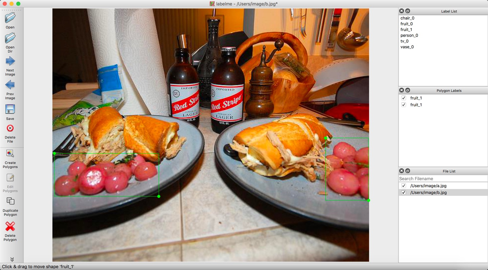

## 3.1.1 使用LabelMe标注自己的数据

***步骤一 准备工作***   
- 对收集的图像划分为训练、验证（非必须）、测试三个部分的数据集，分别存放于对应的文件夹中      
- 创建与图像文件夹相对应的文件夹，用于存储标注的json文件
- 点击”Open Dir“按钮，选择需要标注的图像所在的文件夹打开，则”File List“对话框中会显示所有图像所对应的绝对路径      

***步骤二 标注***           
- 打开矩形框标注工具，具体如下图所示     
<div align=center></div>   

- 使用拖拉的方式对目标物体进行标识，并在弹出的对话框中写明对应label（当label已存在时点击即可），具体如下图所示：

<div align=center></div>        

当框标注错误时，可点击右侧的“Edit Polygons”再点击标注框，通过拖拉进行修改，也可再点击“Delete Polygon”进行删除。

- 当所使用的模型是类似Mask R-CNN这类模型时，虽是目标检测模型，但却需要实例分割信息；所以点击右侧的“Create Polygons”以打点的方式圈出目标的轮廓，具体如下提所示：
<div align=center></div>        

- 点击右侧”Save“，将标注结果保存到步骤一中创建的文件夹中

【注意】在定义label名字时，在名字后加上“_0”或“_1”分别代表目标是一个对象（iscrowd=0）还是一组对象（iscrowd=1），例如下图中的水果单堆分割成一个个水果较不容易，所以将其定义为一组水果对象，label定位“fruit_1”         
<div align=center></div>   


## 3.1.2 对LabelMe标注数据的转换
在命令行中执行下述命令：
```cmd
# 进入Anaconda环境后，安装下述python包
# 安装numpy
pip install numpy
# 安装PIL
pip install Pillow
# 转换
cd ./DataAnnotation
python ./labelme2coco.py \
       --image_input_dir ~/Users/image/ \
       --json_input_dir ~/Users/json/ \
# --image_input_dir：3.1.1的步骤一中创建的图像文件夹路径
# --json_input_dir：image_input_dir所对应的存放LabelMe标注文件的文件夹路径
# 最终转换的json文件存放在image_input_dir父目录下的anatations文件夹下

```
